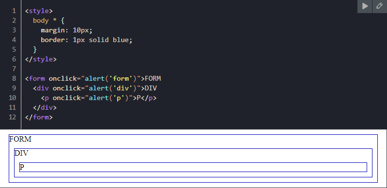
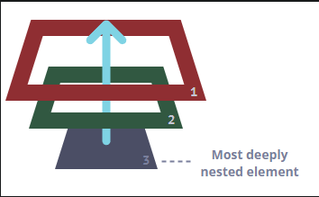
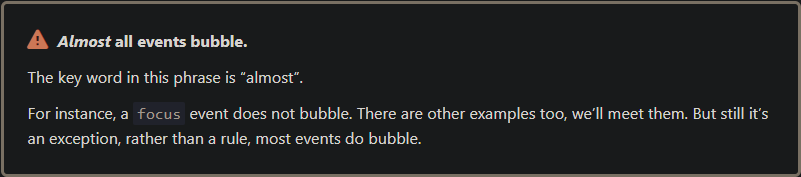

Bubbling
The bubbling principle is simple.

When an event happens on an element, it first runs the handlers on it, then on its parent, then all the way up on other ancestors.

Let’s say we have 3 nested elements FORM > DIV > P with a handler on each of them:

A click on the inner 
 first runs onclick:
1. On that 
.
2. Then on the outer 
.
3. Then on the outer <form>.
4. And so on upwards till the document object.

So if we click on 
, then we’ll see 3 alerts: p → div → form.

The process is called “bubbling”, because events “bubble” from the inner element up through parents like a bubble in the water.

Almost all events bubble.
The key word in this phrase is “almost”.

For instance, a focus event does not bubble. There are other examples too, we’ll meet them. But still it’s an exception, rather than a rule, most events do bubble.